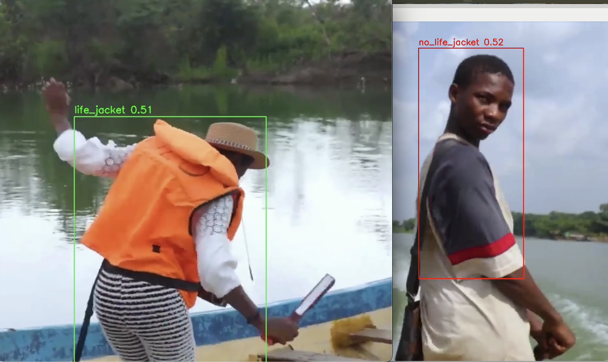

# ML-Life-Jacket-Detection

This is a machine learning-powered system that detects whether individuals are wearing life jackets in real-time. When someone is detected without a life jacket, the system raises an alert with the message:
"⚠️ Attention: Please wear your life jacket."

## 🔧 Tools Used
- YOLOv8 – Object detection
- OpenCV – Image processing and display
- Python – Core logic and integration

## 📊 Dataset
The model is currently trained on a dataset of 1,340 annotated images, which is relatively small. I’m actively annotating and preprocessing more data to improve model accuracy and generalization as the system scales.

